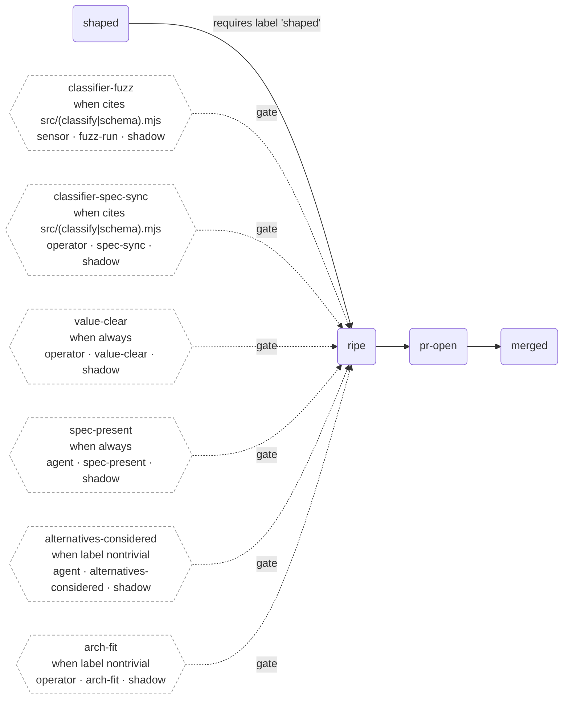
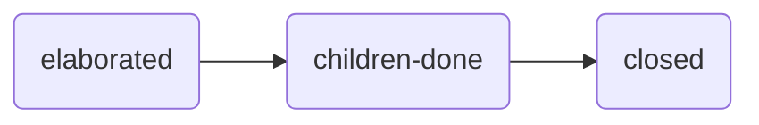

# Tiller

**Tiller answers one question, continuously and honestly: _what should be worked on next, and for everything that isn't ready — exactly why not, and what would change that?_**

It reads a repository's open issues, folds them into a single derived plan, and tells you which pieces of work are ready to start right now. Nothing is hand-maintained; the plan falls out of the facts. Tiller is read-only, deterministic, and has zero runtime dependencies.

> **Status: preliminary.** The engine senses, classifies, and produces a derived plan on every tick. It does **not** yet dispatch work — it tells you what's ready; a human or an agent still picks it up. See [Current status & limitations](docs/architecture.md#current-status--limitations).

---

## Why tiller exists

If you coordinate a large backlog — especially one worked by a mix of humans and autonomous agents — you hit the same problems:

- **"What's actually ready?"** has no cheap answer. An issue can look ready and not be: it depends on unfinished work, it's waiting on a decision only a person can make, its spec isn't settled, or it's embargoed until a date. Working that out by hand, repeatedly, across a hundred issues, is the coordination tax.
- **Milestones and status columns drift.** They're a second, hand-maintained source of truth that quietly disagrees with reality. Someone has to keep them honest, and nobody does.
- **Agents pick up work that isn't ready.** An autonomous session that grabs a not-actually-startable issue burns tokens, produces half-work, and creates cleanup. The cost of a bad "what's next" answer is paid downstream, at scale.
- **"Why isn't this moving?"** is expensive to answer. When a piece of work stalls, reconstructing _why_ — and what would unblock it — means re-reading threads and reverse-engineering intent.

Tiller exists to make that answer **cheap, current, and trustworthy**. You keep working in GitHub issues as normal; tiller derives the plan from them so you never maintain it, and it derives it the same way every time so you can trust it.

## What you get

- **One always-current plan.** Every issue lands in exactly one bucket — **ready to start**, **blocked**, **waiting on its children**, or **done** — with no gaps and no double-counting. Run a tick and you have today's picture.
- **A reason for every "not yet."** Nothing is blocked silently. Each blocked issue carries _every_ reason it's blocked and the specific event that would clear each one — a label, a dependency closing, an operator's stamp, a date arriving. Ask `explain <issue>` and get the exact list.
- **No hand-maintained state.** No milestones to curate, no status columns to drag. Membership and dependencies are _declared_ in issue bodies; the plan is derived. Editing an issue re-derives its place on the next tick, for free.
- **Safe by construction.** Tiller only _reads_ GitHub. It writes nothing back, dispatches nothing, and can't move your work. The worst a bad tick can do is show you a stale plan.
- **Deterministic and auditable.** The same facts always produce the same plan. Everything tiller senses is recorded in an append-only log, so any decision can be replayed and explained after the fact.
- **Nothing to install.** Plain Node, zero dependencies. Tests run on `node --test`.

## See it in action

A tick writes a dated snapshot — the derived plan in human-readable form. An abridged real one:

```markdown
# Engine tick 3 — 2026-07-05

| bucket  | count |
|---------|-------|
| ripe    |     1 |
| holding |     1 |
| parked  |   120 |
| waiting |     0 |
| done    |     0 |

## Ripe (dispatchable)
- #179 Quota-mode test + scheduling decision · floor:inline

## Ripening (held by hysteresis gate)
- #122 AI generation eval rig: real-API dispatch · floor:fullteam

## Attention (parks past their deadline — surfaced to the operator)
- #419 Design-system affordance primitives
  - untracked-dependency since 2026-06-13   [overdue]

## Parked
- #14 Workout session UI and state machine
  - needs-conditioning — clears when: conditioning is granted
- #419 Design-system affordance primitives
  - needs-conditioning   — clears when: conditioning is granted
  - untracked-dependency — clears when: a tracking issue appears, or the deadline surfaces it
```

Read that top to bottom: one issue is ready to dispatch; one just ripened and is being briefly held to confirm it's stable; one blocked issue has sat too long and is escalated for attention; the rest are blocked, each with its reasons and what would unblock them. That whole picture is _derived_ from the issues — nobody wrote it.

## How it works

Every **tick** runs the same five-stage pipeline. Each stage does one job:

1. **Sense** — fetch the open issues, their timelines, comments, and bodies from GitHub (read-only).
2. **Store** — translate what it saw into **facts** and append them to a log. Facts are never edited or deleted; a later fact can _contradict_ an earlier one, but the history stays. This is what makes ticks replayable.
3. **Classify** — a pure function folds the whole fact log so that every issue lands in **exactly one** bucket: `ripe` (ready), `parked` (blocked), `waiting` (a parent whose children aren't done), or `done`.
4. **Verify & gate** — before a `ripe` issue is treated as dispatchable, a thin verifier and a set of **situational gates** check the prerequisites that _this kind_ of work needs (e.g. a spec is clean, an operator has approved). New gates start in **shadow mode**: they report what they _would_ block without blocking anything, so a rule's effect is observable before it binds.
5. **Snapshot** — write the derived plan to `.tiller/snapshots/<date>.md` (and `.json`). A short **hysteresis** step damps flicker so a rapidly-toggling issue doesn't churn the plan.

The result is a plan you can trust the same way twice. The concepts in bold — facts, buckets, gates, hysteresis — are the whole mental model; [**Concepts**](docs/concepts.md) explains each one and _why_ it's shaped that way.

## Quick start

From a bare checkout of this repo (the engine runs against its own backlog by default):

```bash
node src/tick.mjs                 # one live reconciliation tick (read-only fetch)
node src/tick.mjs --offline       # re-derive from the stored fact log only (no network)
node src/explain.mjs 419          # why isn't #419 ready, and what exactly would clear it?
node src/next.mjs                 # what can THIS session pick up right now?
node src/attest.mjs 10 journey-articulation pass   # record an operator's approval stamp
```

Development checks (also run in CI):

```bash
node --test 'test/*.test.mjs'     # the test suite
node test/fuzz.mjs                # classifier property fuzzer (the correctness gate)
node scripts/check-spec.mjs spec/goal-liveness.allium   # check the classifier contract spec
```

To point tiller at a **different** repo (e.g. as a submodule), give it a config file — see [Operating tiller](docs/operating.md).

## Workflows

Each kind of goal moves through an ordered set of **stages**, guarded by situational **gates**. These diagrams are generated from the active config (`node src/diagram.mjs`) and checked by CI — don't edit between the markers by hand.

<!-- tiller:workflows:start -->
### delivery



### journey


<!-- tiller:workflows:end -->

## Learn more

- [**Concepts**](docs/concepts.md) — the mental model in depth: the fact log, the four buckets, the classifier, situational gates, hysteresis, why there are no milestones, and the full catalogue of "blocked" reasons.
- [**Operating tiller**](docs/operating.md) — every command, configuration (`TILLER_CONFIG` and the config exports), running against a target repo, self-hosting, the consumer pin-bump gate, and CI.
- [**Architecture**](docs/architecture.md) — the internal pipeline module by module, the classifier contract spec, how ticks stay deterministic and degraded senses fail safely, and the current status & limitations.

## Origin & license

Tiller was extracted (history-preserving) from
[jimdowning/strengthsys](https://github.com/jimdowning/strengthsys), where the
engine grew up at `design/coordination-model/engine/`. It was built from a
series of validated experiments (E0–E6); those experiments, their corpus, and
the `SYNTHESIS.md` that records the design evidence stay in strengthsys under
[design/coordination-model](https://github.com/jimdowning/strengthsys/tree/main/design/coordination-model).

Licensed under the terms in [LICENSE](LICENSE).
