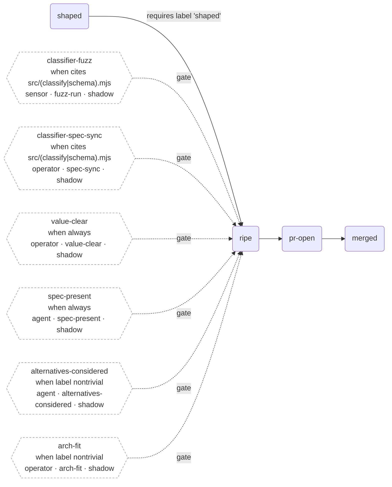
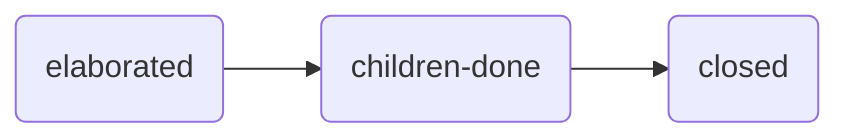

# Tiller

**Tiller exists to make human attention the resource a product organisation spends deliberately.** It concentrates that attention into a few high-value sessions, shifts verification early enough that everything else can run unsupervised, and then matches each unit of work to a session actually capable of doing it.

Operationally, that means answering one question, continuously and honestly: _what should **this session** work on next given what it can do — and for everything that isn't ready, exactly why not, and what would change that?_

It reads a repository's open issues, folds them into a single derived plan, and tells you which pieces of work are ready to start right now. Nothing is hand-maintained; the plan falls out of the facts. Tiller is read-only, deterministic, and has zero runtime dependencies.

> **Status: preliminary — the North Star below runs well ahead of the build.** What exists today is the sensing / classification / gating core: every tick derives the plan, evaluates quality gates in shadow mode, and `next` matches goals against a session's freshly probed capabilities. What does _not_ exist yet: the upstream pipeline that takes a vague product idea to a dispatchable spec, the delivery-half gates that need the ADR-0001 DAG, any notion of a node's **interaction mode**, and any necessity/sufficiency constraint on generated plans. Tiller also does not dispatch — it tells you what's ready; a human or an agent still picks it up. See [Current status & limitations](docs/architecture.md#current-status--limitations).

---

## Why tiller exists

Four beliefs shape everything below. The first two are the bets. The second two are constraints that fall out of them.

### 1. Human attention is the scarce resource — not agent throughput

The default in agentic product development is to optimise for **maximum self-guided agent work**: give the agent a long leash and let it run. The residue lands on the humans — project management, bot-sitting, picking up half-finished work, answering an agent's question forty minutes into a session. That is neither where people shine nor where the throughput is.

Throughput comes from the opposite move: **isolate and concentrate human attention into a few high-value sessions, and build automation around them.** Tiller is an attempt at the second half.

One sharp consequence: every work node should sit at a pole — **human-only**, **highly interactive**, or **highly automated**. The common middle — an agent works for an hour, blocks to ask a question, then starts again — is an antipattern, not a workflow. It spends human attention at the moment of lowest leverage and least context. When a node behaves that way the finding is not "the human was slow to answer"; it is **that node is mis-structured**. The question it hit should have been settled before dispatch (see 2), or split out as a node of its own.

### 2. Quality shifts left, and the shift now pays twice

All-human processes could afford late quality: incremental definition of need, code review after the code exists, thin unit testing with defects caught by feedback loops downstream. Every one of those loops costs **parallelism** — each re-entry has to be merged back in. It was tolerable, because shifting quality left was expensive and the ROI often didn't clear.

Agentic development moves both sides of that trade. The loops get *worse*: the pace mismatch between agent work and human work makes each re-entry cost more parallelism, not less. And left-shifting gets both cheaper and more valuable, because a verification artifact created early is no longer just a defect filter — it is **the specification that steers the agent and lets it supervise itself**. Left-shifted quality pays twice now.

So tiller's job is to be **the place a product encodes how far left its V&V sits**, as rules the engine actually holds work against. For example:

- every change states the value it adds to users, and how;
- verification criteria and an allium spec exist before any code is written;
- a change with UI has a human-validated mock before implementation begins;
- multiple review passes have run **before** a PR is proposed, not after it.

And the arc that follows: tiller should be how you get from **a vague idea about a product change to a delivered one** — refining and clarifying incrementally, at the early points where clarification is still cheap.

### 3. Generated plans must pass necessity and sufficiency (constraint)

Agents asked to write and maintain plans write **maximal** plans. Execute them and milestones recede into the distance, because work is added faster than it is done. This is the direct hazard of belief 2: the same automated elaboration that generates preconditions and specs also generates scope.

So the generation in 2 only ships alongside constraints that apply **necessary** and **sufficient** rigorously — nothing enters a plan that isn't necessary to the stated value, and a plan is finished when it is sufficient, not when nothing further can be thought of.

### 4. Dispatch is a match, not a queue (constraint)

Sessions are not alike. One is an isolated VM with internet access and few tools — good for web research. One is a capable dev environment. Per belief 1, a few are interactive and most should not be. So the question a work-dispatch system has to answer is never "what is next" in the abstract; it is **"what is next _given my capabilities_"** — a match between a goal's requirements and a session's probed capabilities, with interactivity as a first-class capability alongside the tools.

## What you get

In a shared backlog these beliefs cash out as concrete relief: "what's actually ready?" gets a cheap answer instead of a per-issue investigation; there are no hand-maintained milestones or status columns to drift out of true; an agent session can't burn an hour on work that was never startable; and "why isn't this moving?" is answered from the record rather than reconstructed from threads.

- **One always-current plan.** Every issue lands in exactly one bucket — **ready to start**, **blocked**, **waiting on its children**, or **done** — with no gaps and no double-counting. Run a tick and you have today's picture.
- **A reason for every "not yet."** Nothing is blocked silently. Each blocked issue carries _every_ reason it's blocked and the specific event that would clear each one — a label, a dependency closing, an operator's stamp, a date arriving. Ask `explain <issue>` and get the exact list.
- **No hand-maintained state.** No milestones to curate, no status columns to drag. Membership and dependencies are _declared_ in issue bodies; the plan is derived. Editing an issue re-derives its place on the next tick, for free.
- **Safe by construction.** Tiller only _reads_ GitHub. It writes nothing back, dispatches nothing, and can't move your work. The worst a bad tick can do is show you a stale plan.
- **Deterministic and auditable.** The same facts always produce the same plan. Everything tiller senses is recorded in an append-only log, so any decision can be replayed and explained after the fact.
- **Nothing to install.** Plain Node, zero dependencies. Tests run on `node --test`.

## See it in action

A tick writes a dated snapshot — the derived plan in human-readable form. An abridged real one:

```markdown
# Engine tick 3 — 2026-07-05

| bucket  | count |
|---------|-------|
| ripe    |     1 |
| holding |     1 |
| parked  |   120 |
| waiting |     0 |
| done    |     0 |

## Ripe (dispatchable)
- #179 Quota-mode test + scheduling decision · floor:inline

## Ripening (held by hysteresis gate)
- #122 AI generation eval rig: real-API dispatch · floor:fullteam

## Attention (parks past their deadline — surfaced to the operator)
- #419 Design-system affordance primitives
  - untracked-dependency since 2026-06-13   [overdue]

## Parked
- #14 Workout session UI and state machine
  - needs-conditioning — clears when: conditioning is granted
- #419 Design-system affordance primitives
  - needs-conditioning   — clears when: conditioning is granted
  - untracked-dependency — clears when: a tracking issue appears, or the deadline surfaces it
```

Read that top to bottom: one issue is ready to dispatch; one just ripened and is being briefly held to confirm it's stable; one blocked issue has sat too long and is escalated for attention; the rest are blocked, each with its reasons and what would unblock them. That whole picture is _derived_ from the issues — nobody wrote it.

## How it works

Every **tick** runs the same five-stage pipeline. Each stage does one job:

1. **Sense** — fetch the open issues, their timelines, comments, and bodies from GitHub (read-only).
2. **Store** — translate what it saw into **facts** and append them to a log. Facts are never edited or deleted; a later fact can _contradict_ an earlier one, but the history stays. This is what makes ticks replayable.
3. **Classify** — a pure function folds the whole fact log so that every issue lands in **exactly one** bucket: `ripe` (ready), `parked` (blocked), `waiting` (a parent whose children aren't done), or `done`.
4. **Verify & gate** — before a `ripe` issue is treated as dispatchable, a thin verifier and a set of **situational gates** check the prerequisites that _this kind_ of work needs (e.g. a spec is clean, an operator has approved). Gates are where belief 2 becomes mechanical: they are how a project states, in data, how far left its verification sits. New gates start in **shadow mode**: they report what they _would_ block without blocking anything, so a rule's effect is observable before it binds.
5. **Snapshot** — write the derived plan to `.tiller/snapshots/<date>.md` (and `.json`). A short **hysteresis** step damps flicker so a rapidly-toggling issue doesn't churn the plan.

The result is a plan you can trust the same way twice. The concepts in bold — facts, buckets, gates, hysteresis — are the whole mental model; [**Concepts**](docs/concepts.md) explains each one and _why_ it's shaped that way.

## Quick start

From a bare checkout of this repo (the engine runs against its own backlog by default):

```bash
node src/tick.mjs                 # one live reconciliation tick (read-only fetch)
node src/tick.mjs --offline       # re-derive from the stored fact log only (no network)
node src/explain.mjs 419          # why isn't #419 ready, and what exactly would clear it?
node src/next.mjs                 # what can THIS session pick up right now?  (belief 4)
node src/attest.mjs 10 journey-articulation pass   # record an operator's approval stamp
```

Development checks (also run in CI):

```bash
node --test 'test/*.test.mjs'     # the test suite
node test/fuzz.mjs                # classifier property fuzzer (the correctness gate)
node scripts/check-spec.mjs spec/goal-liveness.allium   # check the classifier contract spec
```

To point tiller at a **different** repo (e.g. as a submodule), give it a config file — see [Operating tiller](docs/operating.md).

## Workflows

Each kind of goal moves through an ordered set of **stages**, guarded by situational **gates**. These diagrams are generated from the active config (`node src/diagram.mjs`) and checked by CI — don't edit between the markers by hand.

<!-- tiller:workflows:start -->
### delivery


```mermaid
graph LR
  classDef gate fill:#fff,stroke:#999,stroke-dasharray:4 3;
  classDef enforce stroke:#c00,stroke-width:2px;
  s_shaped("shaped")
  s_ripe("ripe")
  s_pr_open("pr-open")
  s_merged("merged")
  s_shaped -->|requires label 'shaped'| s_ripe
  s_ripe --> s_pr_open
  s_pr_open --> s_merged
  g_classifier_fuzz{{"classifier-fuzz<br/>when cites src/(classify|schema).mjs<br/>sensor · fuzz-run · shadow"}}
  g_classifier_fuzz -.gate.-> s_ripe
  class g_classifier_fuzz gate
  g_classifier_spec_sync{{"classifier-spec-sync<br/>when cites src/(classify|schema).mjs<br/>operator · spec-sync · shadow"}}
  g_classifier_spec_sync -.gate.-> s_ripe
  class g_classifier_spec_sync gate
  g_value_clear{{"value-clear<br/>when always<br/>operator · value-clear · shadow"}}
  g_value_clear -.gate.-> s_ripe
  class g_value_clear gate
  g_spec_present{{"spec-present<br/>when always<br/>agent · spec-present · shadow"}}
  g_spec_present -.gate.-> s_ripe
  class g_spec_present gate
  g_alternatives_considered{{"alternatives-considered<br/>when label nontrivial<br/>agent · alternatives-considered · shadow"}}
  g_alternatives_considered -.gate.-> s_ripe
  class g_alternatives_considered gate
  g_arch_fit{{"arch-fit<br/>when label nontrivial<br/>operator · arch-fit · shadow"}}
  g_arch_fit -.gate.-> s_ripe
  class g_arch_fit gate
```

### journey


```mermaid
graph LR
  classDef gate fill:#fff,stroke:#999,stroke-dasharray:4 3;
  classDef enforce stroke:#c00,stroke-width:2px;
  s_elaborated("elaborated")
  s_children_done("children-done")
  s_closed("closed")
  s_elaborated --> s_children_done
  s_children_done --> s_closed
```
<!-- tiller:workflows:end -->

## Learn more

- [**Concepts**](docs/concepts.md) — the mental model in depth: the fact log, the four buckets, the classifier, situational gates, hysteresis, why there are no milestones, and the full catalogue of "blocked" reasons.
- [**Operating tiller**](docs/operating.md) — every command, configuration (`TILLER_CONFIG` and the config exports), running against a target repo, self-hosting, the consumer pin-bump gate, and CI.
- [**Architecture**](docs/architecture.md) — the internal pipeline module by module, the classifier contract spec, how ticks stay deterministic and degraded senses fail safely, and the current status & limitations.

## Origin & license

Tiller was extracted (history-preserving) from
[jimdowning/strengthsys](https://github.com/jimdowning/strengthsys), where the
engine grew up at `design/coordination-model/engine/`. It was built from a
series of validated experiments (E0–E6); those experiments, their corpus, and
the `SYNTHESIS.md` that records the design evidence stay in strengthsys under
[design/coordination-model](https://github.com/jimdowning/strengthsys/tree/main/design/coordination-model).

Licensed under the terms in [LICENSE](LICENSE).
